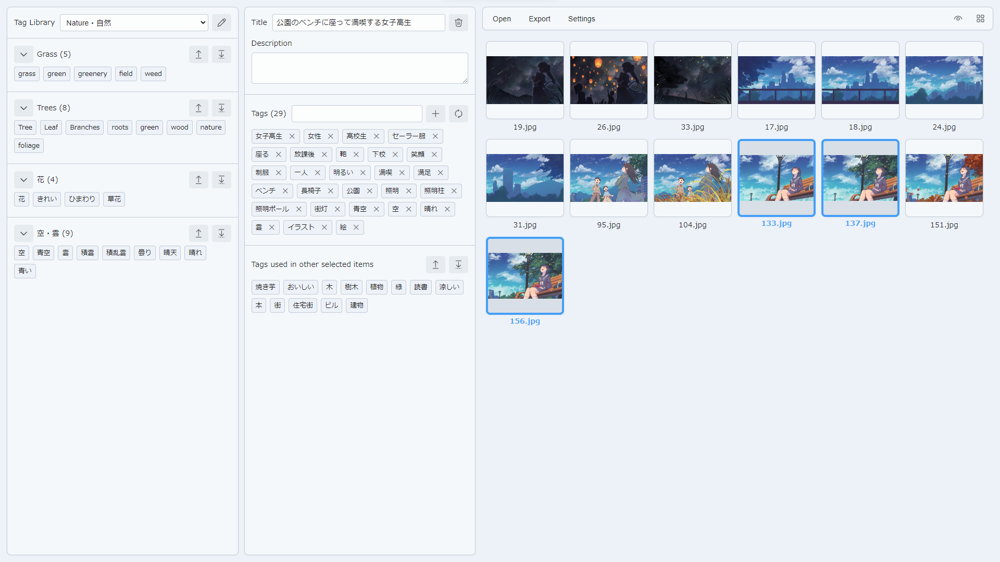

# Meta Tagging

An app for editing and managing the metadata of image, specially for the purpose of managing tags in stock photo/illustration. 
You can keep most-used tags in the library, keep them organized, and reuse them again whenever you need.

All basic functions are implemented. Request and bug reports are welcome, but I cannot promise any update to them as it is mostly built for personal use.

このアプリはストックフォト・ストックイラストのための画像の情報を編集するのに作られたメタデータの管理アプリです。
特にタグの保管、分類や整理、簡易に再利用などに特化しています。

基本的な機能はすべて搭載済み。要望やバグ報告などは提出できますが、個人のための開発のため、実装のお約束はできかねますのでご了承ください。

| Section  | Currently Support |
| ------------- | ------------- |
| Input Area  | Title, Description/Comment, Tags/Keywords  |
| Metadata Type  | EXIF, IPTC, XMP  |
| File Format  | JPEG |
| Language  | English, Japanese  |
| Theme  | Light, Dark  |
| OS | Windows (Unsure on other OS) |

| セクション  | 現在サポートしているもの |
| ------------- | ------------- |
| 入力項目  | タイトル、コメント・キャプション、タグ・キーワード  |
| メタデータ種類  | EXIF、IPTC、XMP  |
| ファイルフォーマット  | JPEG |
| 言語  | 英語、日本語  |
| テーマ  | ライト、ダーク  |
| OS | Windows（他のOSについては未確認） |

## Credits

- [NW.js](https://github.com/nwjs/nw.js)
- [Mithril.js](https://github.com/MithrilJS/mithril.js/)
- [Fluent UI System Icons](https://github.com/microsoft/fluentui-system-icons)
- [exiftool-vendored](https://github.com/photostructure/exiftool-vendored.pl)
